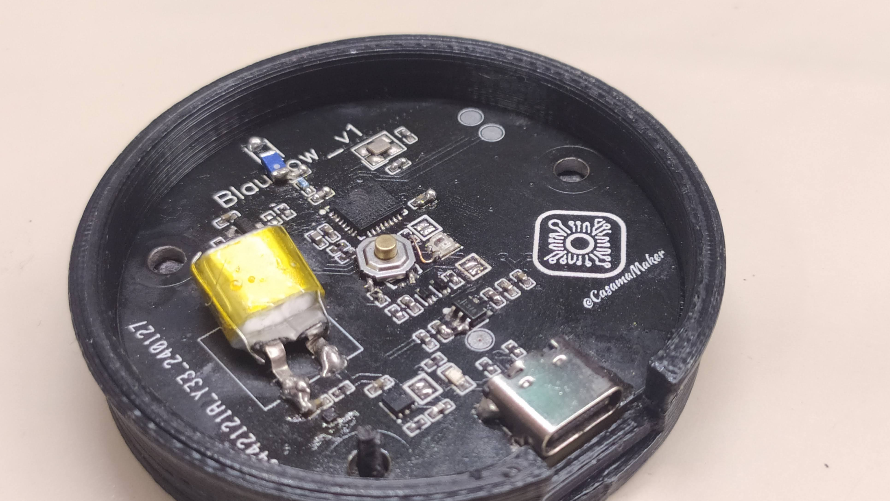

# BlauLink
My IoT switch idea design

The BlauLink is a tiny WiFi and BLE IoT button for several applications. Originally designed for smart home things using ESP-NOW, the BlauLink can also be used as an actuator for IFTTT automations or as an MQTT device. It is based on the single core ESP32-C3 RISC-V processor and therefore comes with tons of useful features. with dimensions of a suitable switch, similar to the [Mi Wireless Switch](https://tuxiaomi.es/informatica/mi-wireless-switch-global-version/). Optimized to not charge the battery for at least a year.

## Vision points before development 
- Battery powered
- Battery charger and protection integrated & easy to charge
- ESPNOW fast protocol direct to control lamp, instead wifi or bluetooth
- Integration 3D print and electronics
- Easy ensamblation
- 1 year battery duration (4 clicks/day)
- Inspiration designs: [PicoClick-C3](https://github.com/makermoekoe/Picoclick-C3) and [OBJEX_LINK](https://github.com/salvatoreraccardi/OBJEX_LINK)
